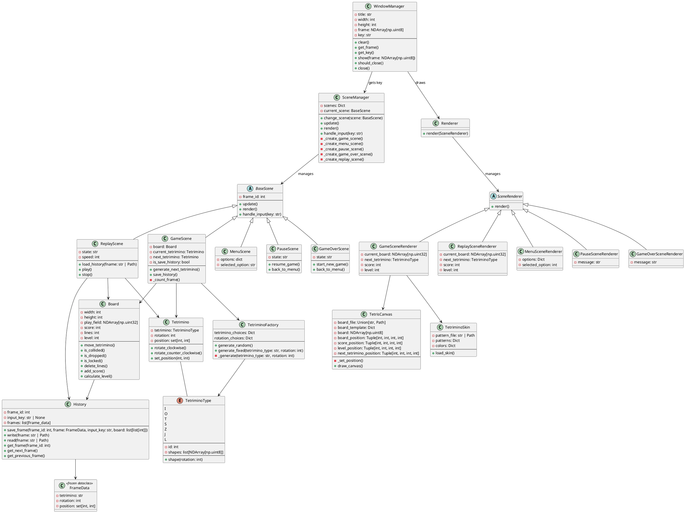

# Tetris in Python

## Introduction

This repository is an implementation of Tetris in Python.

Key features:

- **Python-based Tetris**: Implemented entirely in Python
- **OpenCV for rendering**: The game window and graphics are drawn using OpenCV
- **Modular architecture**: Game logic (core) and UI (rendering) are separated for clarity
- **Unit testing**: Includes tests for core components such as `Tetrimino` and `Board`
- **Object-oriented design**: Class diagrams are provided below

This project focuses on learning software development practices, including:

- Requirement definition and internal design
- Class diagram and modular architecture
- Step-by-step implementation with unit tests

---

## Repository Overview

- `core/` – Core game logic (board, tetrimino, history)
- `ui/` – Rendering and window management using OpenCV
- `tests/` – Unit tests for core modules

---

## Class diagram
The following class diagram provides an overview of the core structure of this Tetris implementation, including the main classes and their relationships. It distinguishes between the game logic and the UI layer, which are designed to be modular and loosely coupled. (This diagram was generated using PlantUML.)

